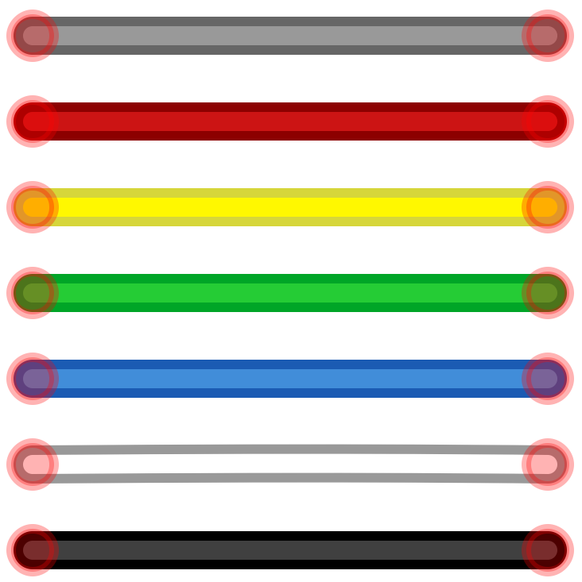
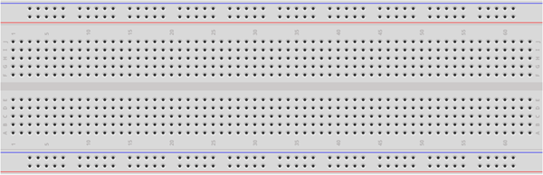
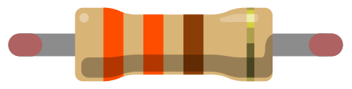
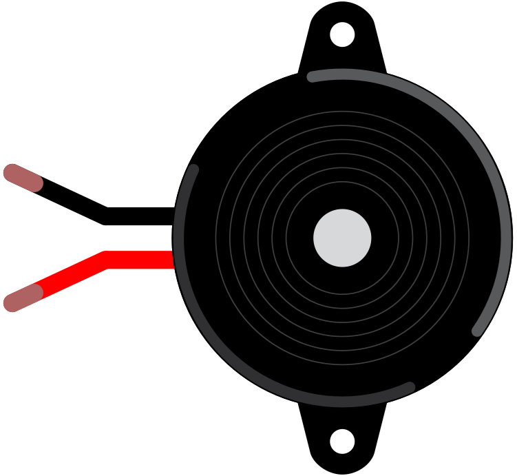
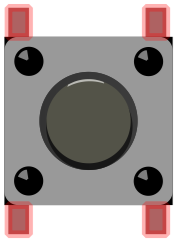
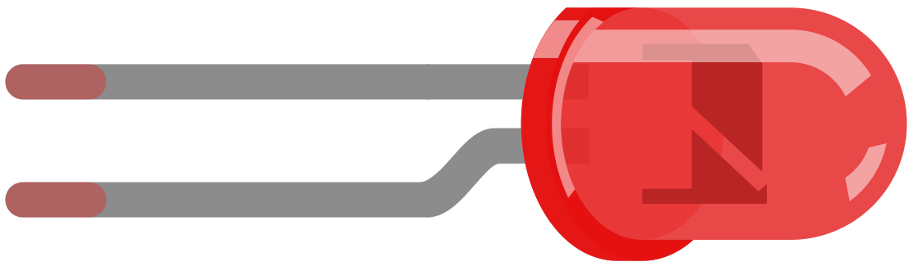
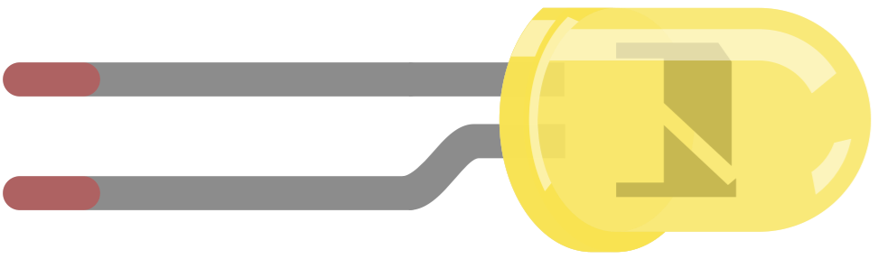

Components used in this volume (see [fritzing.org](https://fritzing.org/) for components created with Fritzing): 

| Description            | Image               |
| ---------------------- | ------------------- |
| Male-to-male jumper wires                    |  |
| Full-sized Breadboard                        |  |
| 330 Ohm resistors (orange, orange, and brown stripes) |  |
| Active Piezo Buzzer |  |
| Push button switch |  |  
| Red LED - the cathode (- negative) lead is the shorter lead - the anode (+ positive) lead is the longer lead |  |
| Yellow LED - the cathode (- negative) lead is the shorter lead - the anode (+ positive) lead is the longer lead |  |
| Green LED - the cathode (- negative) lead is the shorter lead - the anode (+ positive) lead is the longer lead |  |
<figcaption align="center">Components used in this volume</figcaption>