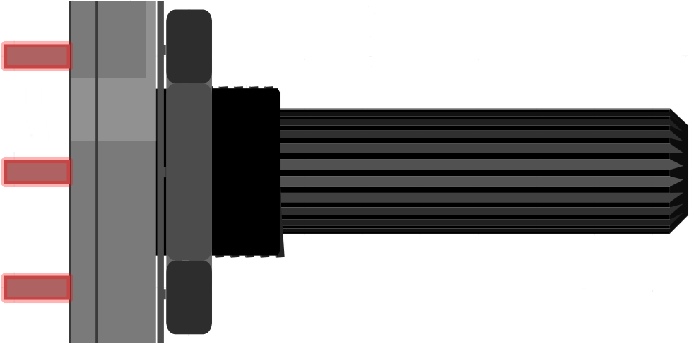

Components used in this volume (see [fritzing.org](https://fritzing.org/) for components created with Fritzing): 

| Description            | Image               |
| ---------------------- | ------------------- |
| Half-sized Breadboard                                 |  |
| Full-sized Breadboard                                 |  |
| Male-to-male jumper wires                             |  |
| 330 Ohm resistors (orange, orange, and brown stripes) |  |
| Red LED - the cathode (- negative) lead is the shorter lead - the anode (+ positive) lead is the longer lead |  |
| Yellow LED - the cathode (- negative) lead is the shorter lead - the anode (+ positive) lead is the longer lead |  |
| 10 Ohm Potentiometer (linear or logarithmic) |  |
| SG90 Servomotor |  |
| TT Motor |  |
| DRV8833 |  |
| ULN2003 Motor Driver and 28BYJ-48 5V Stepper Motor |  |
| External 6V Power Supply |  |
| External 5V DC Power Source (*not from your Pico!*) |   |

<figcaption align="center">Components used in this volume</figcaption>

